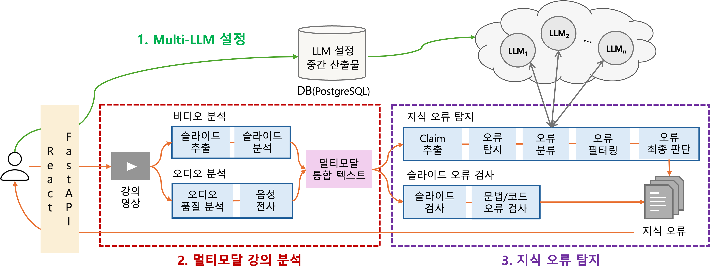
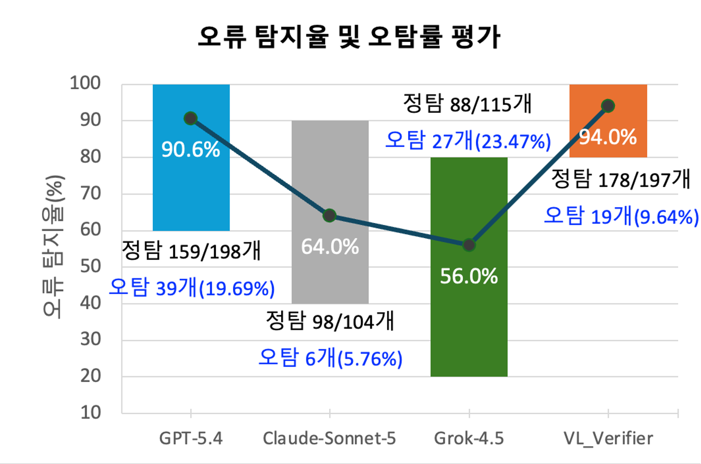
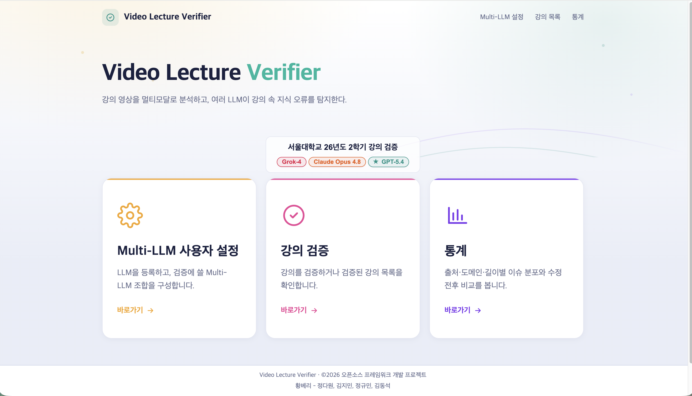
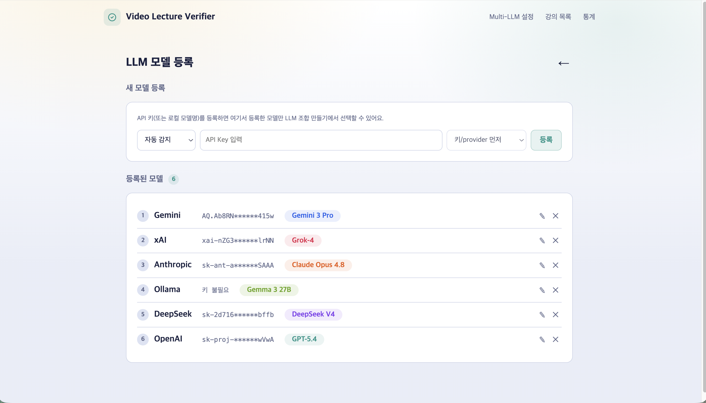
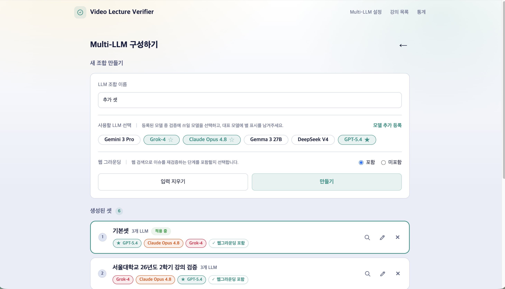
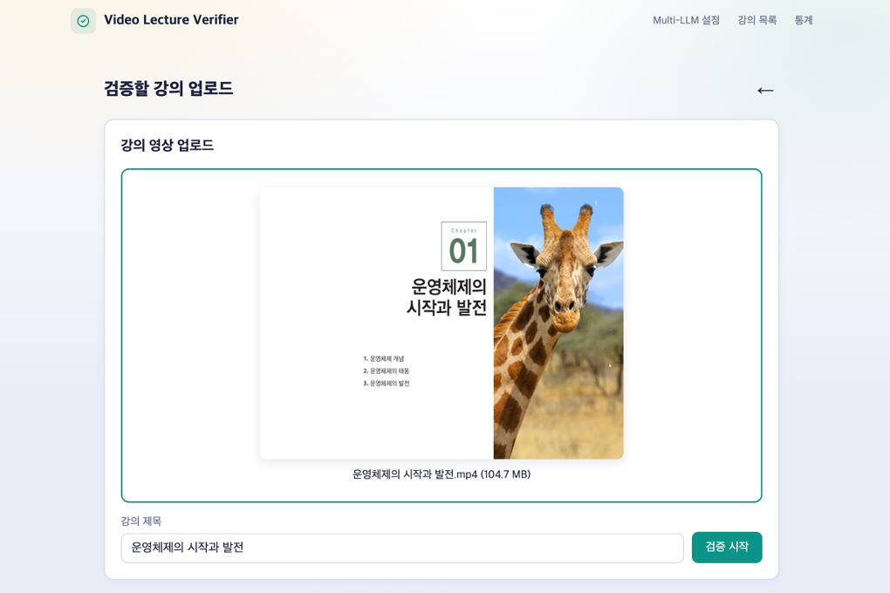
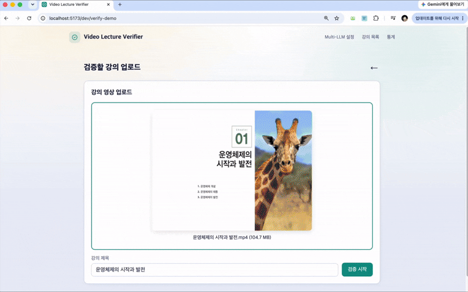
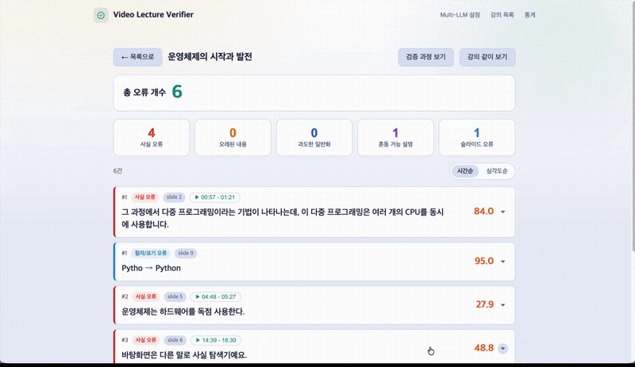

  

<i>멀티모달 기법과 사용자가 임의 구성한 Multi-LLM을 활용하여, 강의 영상의 다양한 지식 오류를 탐지하고 상세한 피드백을 제공하는 오픈소스 프레임워크</i>

  
  
  
  

 

## 📌 1. 작품 개요

### 1.1 문제 인식

&nbsp;&nbsp;오늘날 온라인 강의 영상은 지식을 전달하고 학습하는 주요 수단으로 자리 잡았다. 교육 분야에서도 교내 e-class와 같은 LMS는 물론 K-MOOC, KOCW와 같은 이러닝 플랫폼 등 수많은 강의 영상이 지속적으로 제공, 소비되고 있다. 하지만 강의 영상 내의 오류를 검증하지 않고 있으며, 이로 인해 학습자들은 잘못된 지식을 받아들이게 되고, 오류를 가진 지식이 전파되는 악순환 속에서 교육의 질이 하락하는 심각한 문제를 초래할 수 있다.

&nbsp;&nbsp;그러나 기존 영상 검증 시스템은 강의의 형식적 품질을 평가하거나, 가짜 뉴스·조작 영상의 진위 여부 판별에만 초점이 맞추어져 있어 강의 영상 오류 검증에는 활용할 수 없다. 한편으로 LLM에게 직접 질의하는 방식도 가능하지만, 영상을 직접 업로드하여 오류를 확인하기엔 용량의 한계가 있고, LLM이 아직 학습하지 않은 최신 정보는 반영하기 어려울 뿐만 아니라, 환각으로 인해 맞는 내용을 오류라고 잘못 판단하거나 같은 질문에 다른 답변을 내놓는 등 오류 탐지의 신뢰성을 단언하기 어렵다.

---

<i>이에 본 팀은 영상을 심층 분석하는 <u><strong>멀티모달 기법</strong></u>과 여러 LLM의 판단을 교차 검증하는 <u><strong>Multi-LLM</strong></u>을 결합하여, 강의에 내재된 <u><strong>5개 유형의 지식 오류를 탐지</strong></u>하고 자세한 피드백을 제공하는 오픈소스 프레임워크, Video Lecture Verifier를 개발하였다.</i>

---

### 1.2 도전 목표

&nbsp;&nbsp;세부 목표는 다음과 같다.

1. **사용자의 자유로운 Multi-LLM 구성** — 목적이나 LLM의 발전을 반영하여, 사용자가 자유롭게 여러 LLM 모델들로 Multi-LLM을 구성할 수 있는 유연성 확보
2. **멀티모달 기법으로 영상 강의를 심층 분석해 문맥 반영** — 오류 탐지의 품질을 좌우하는 중요한 과정으로, 발화·텍스트·시각자료 등을 멀티모달로 분석
3. **Multi-LLM을 활용한 강의 내 지식 오류 탐지** — 여러 LLM의 교차 판단으로 단일 LLM이 놓치는 오류까지 폭넓게 탐지하여, 탐지율은 높이고 오탐률은 낮춤
4. **오류에 대한 판단 근거와 수정안을 포함한 자세한 피드백 제공** — 지식 오류를 5가지 유형으로 세분화하여 탐지하고, 판단 근거와 수정안 등을 함께 제공

 
 

## ⚙️ 2. 시스템 구조

&nbsp;&nbsp;Video Lecture Verifier의 전체 시스템 구조는 아래 그림과 같다. 사용자가 LLM 조합을 설정하면, 강의 영상은 **멀티모달 강의 분석**과 **지식 오류 탐지**의 2단계로 처리된다.

1. **Multi-LLM 설정** — 사용자가 지식 오류 탐지에 사용할 LLM들을 등록하고 조합을 결정한다. 확정된 조합은 DB(PostgreSQL)에 저장되어, 이후 단계에서 참조되는 기준 설정으로 기능한다.
2. **멀티모달 강의 분석** — 강의 영상을 비디오와 오디오로 나누어 병렬 분석한 뒤, 강의 맥락을 연결한 하나의 멀티모달 통합 텍스트를 생성한다.
3. **지식 오류 탐지** — 사용자가 설정한 Multi-LLM을 활용해 통합 텍스트에서 강의 내 지식 오류를 탐지하고 상세 피드백을 제공한다.

### 2.1 Video Lecture Verifier가 탐지하는 지식 오류 유형

| 오류 유형 | 설명 |
|---|---|
| 사실 오류 | 강의 내용이 객관적 사실과 다른 경우 |
| 오래된 내용 | 제작 이후 갱신되었거나 더 이상 유효하지 않은 정보 |
| 과도한 일반화 | 예외나 조건을 생략하거나 단정적으로 서술된 내용 |
| 혼동 가능 설명 | 문맥상 옳고 그름을 단정하기 어려우나 학습자에게 혼동을 줄 수 있는 모호한 설명 |
| 슬라이드 오류 | 오탈자, 수치·단위 오류, 코드 문법 오류, 시각적 결함 등 |

### 2.2 핵심 기능 상세

<b>1) Multi-LLM 설정</b>

&nbsp;&nbsp;사용자는 지식 오류 탐지에 사용할 LLM들을 직접 등록하고 조합(셋)을 결정한다. 확정된 조합은 DB에 저장되며, 이후 전처리·탐지 전 단계에서 참조되는 기준 설정으로 기능한다. 특정 LLM에 종속되지 않는 어댑터 구조로, 목적이나 LLM의 발전에 맞춰 N개의 모델로 자유롭게 확장할 수 있다.

 

<b>2) 멀티모달 비디오 분석</b>

&nbsp;&nbsp;인물을 마스킹 처리하고 영상 구간을 슬라이드/비디오/불명 구간으로 분류한 뒤, 프레임 변화량(MSE)·해시 유사도(pHash)·엣지 변화·히스토그램 비교를 함께 사용해 슬라이드가 바뀌는 시점을 탐지하고 대표 프레임(base)을 추출한다. 이후 동일 슬라이드 재등장 여부를 판단해 중복을 제거하고, base 프레임의 본문뿐 아니라 표·그림·도식·차트 등 시각 자료까지 텍스트로 변환한다.

 

<b>3) 멀티모달 오디오 분석</b>

&nbsp;&nbsp;오디오를 분리해 길이·음량·침묵 구간·피치 등 음질을 분석한 뒤, Whisper로 음성을 전사한다. 이때 침묵 구간 기준으로 세그먼트를 나누어 전사함으로써 할루시네이션을 줄이고, 슬라이드 텍스트와 강의 맥락을 참고해 오인식·전문용어·띄어쓰기 오류를 교정한다. 이후 시간 간격·문장 부호·주제 연속성을 고려해 세그먼트를 의미 단위의 발화로 재구성하고, 슬라이드 정보를 기준으로 비디오·오디오 분석 결과를 하나의 통합 텍스트로 결합한다.

 

<b>4) 지식 오류 탐지 (5단계)</b>

&nbsp;&nbsp;통합 텍스트를 입력으로, 발화 기반 탐지(5단계)와 슬라이드 기반 탐지가 병렬로 진행된다.

- **Step 1. Claim Extraction** — 사실 여부를 판단할 수 있는 문장(claim) 추출
- **Step 2. Issue Detection** — 각 LLM이 독립적으로 오류 가능성을 판단해 후보를 폭넓게 탐지
- **Step 3. Issue Classification** — 오류 후보를 5가지 유형으로 분류하고, 투표 알고리즘으로 최종 분류 결정
- **Step 4. Issue Filtering** — 웹서치를 통해 LLM이 학습하지 않은 최신 정보로 오탐 가능성이 있는 오류 분류
- **Step 5. Issue Judgement** — 갱신된 후보에 대해 모델별 세부 점수(`is_valid_issue`, `category_severity`, `context_resolution`)를 산출하고, 가중 평균으로 최종 점수를 계산해 지식 오류를 확정

&nbsp;&nbsp;슬라이드 기반 탐지는 이와 별개로, 슬라이드 텍스트만을 대상으로 모든 LLM이 오탈자·문장 간 논리적 모순 등 형식 오류를 병렬 탐지한다.

 

<b>5) 상세 피드백 제공</b>

&nbsp;&nbsp;최종 확정된 이슈는 오류 유형별로 구분되어 제공된다. 오류가 발생한 원문 발화와 영상 구간 위치, Multi-LLM이 해당 오류를 판단한 근거, 오류의 심각도, 그리고 개선을 위한 수정 제안이 함께 제공된다. 플랫폼별·도메인별 오류 경향이나 분석 소요 시간 등을 파악할 수 있는 분석 통계 시각화도 함께 제공한다.

 
 

## 📊 3. 성능 평가

- **높은 정량적 성능 달성**

  본 팀은 강의 영상 15개에 각각 10개의 오류를 의도적으로 주입한 데이터셋을 구성하고, GPT-5.4·Claude-Sonnet-5·Grok-4.5를 각각 단일로 사용한 경우와 세 모델을 함께 사용한 Video Lecture Verifier의 성능을 비교 평가하였다.

  

  - **오류 탐지율**: 주입 오류 중 실제 탐지된 오류의 비율 — Video Lecture Verifier **94.0%**로 가장 높은 탐지 성능
  - **오탐률**: 탐지된 오류 중 실제 오류가 아닌 것의 비율 — Video Lecture Verifier **9.64%**
  - **소요 시간**: 멀티모달 분석부터 오류 탐지·피드백 제공까지 — 강의 길이 1분당 **15.35초**
   
   
  GPT-5.4는 탐지율은 높지만 오탐률도 함께 높았고, Claude-Sonnet-5는 오탐률이 가장 낮은 대신 탐지율이 낮았다. <u><strong>Video Lecture Verifier</strong></u>는 두 지표를 함께 고려했을 때 <u><strong>가장 변동성이 적은, 균형 잡힌 성능</strong></u>을 보였다.
   
   

## 👀 4. 우수성
- **오픈소스로서의 우수성**

  특정 LLM에 종속되지 않는 구조로, 기관이나 사용처의 환경과 목적에 맞는 LLM을 자유롭게 구성하여 활용할 수 있다. 사용자가 자체 환경에 맞게 기능을 추가하거나 오류 탐지 방식을 확장하는 것도 가능하다.

- **근거 기반의 자세한 피드백 제공**

  단순히 오류 여부만 알려주는 것이 아니라, Multi-LLM 각각의 판단 근거와 문제의 심각도, 수정 제안까지 함께 제공하여 강의 제작자가 실제로 강의를 개선하는 데 바로 활용할 수 있다.

- **혁신성 및 차별점**
  - 발화와 슬라이드를 함께 멀티모달로 분석해 강의 맥락을 반영
  - 특정 LLM에 종속되지 않는 어댑터 구조로, 제약 없이 N개의 LLM 모델로 확장 가능
  - 웹 검색을 통해 LLM이 학습하지 않은 최신 정보까지 반영해 오탐률 감소
  - 지식 오류를 5개의 세부 유형으로 세분화하여 탐지
  - Multi-LLM의 의견 불일치를 활용한 오탐 필터링 알고리즘 개발

 
 

## 👍 5. 활용 분야

- **이러닝 플랫폼 적용**

  대학의 e-class나 K-MOOC, KOCW, Coursera 등 다양한 국내외 이러닝 플랫폼에 즉시 적용 가능하다.

- **기업 교육 영상 검증**

  방대한 양의 직무 교육 영상을 자체 제작하는 대기업 및 기업 교육 전문 기업의 영상 검증에 도입할 수 있다.

- **개인 강의 제작자의 자가 점검 도구**

  개인 강의 제작자가 YouTube, 인프런 등의 플랫폼에 영상을 업로드하기 전, 자가 점검 도구로 활용할 수 있다.

 
 

## 🔧 6. 적용 기술

### - 개발 환경

### - 개발 도구

### - 개발 언어

 
 

## 🖼 7. 프로젝트 결과

#### 메인 화면

#### LLM 모델 등록

#### Multi-LLM 조합 구성

#### 강의 영상 업로드

#### 강의 영상 분석 및 검증 진행

#### 지식 오류 탐지 결과 및 피드백

 

### 시연 영상

<a href="https://youtu.be/tG65MpIfNlI" target="_blank"><b>▶ 보러가기</b></a>

  

 

  

